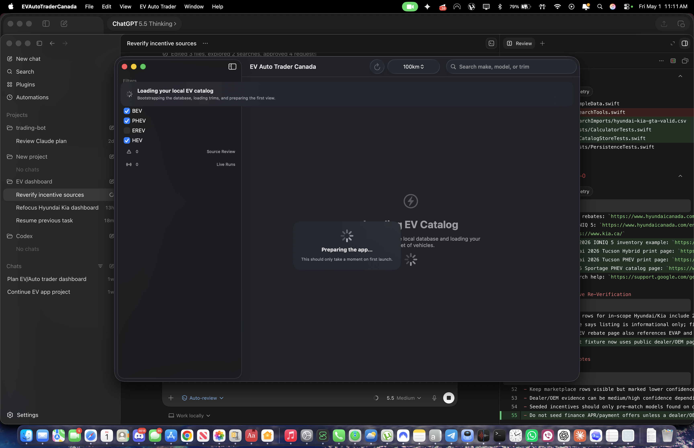

# Hyundai/Kia Deal Leverage Dashboard

Native macOS buyer-side negotiation dashboard for new 2025-2026 Hyundai/Kia electrified vehicles in Canada, built with SwiftUI, SQLite, and source-backed research import.

Current working path: manual refresh plus ChatGPT/Gemini Deep Research CSV/JSON import. The app ranks leverage using dealer weakness, real discounts, nearby alternatives, source-backed incentives, and evidence quality. It does not invent finance payments, does not scrape login/CAPTCHA/private-token sources, and treats marketplace rows as low confidence until dealer/OEM-confirmed.

Latest verified UI capture:



## Start Here
- Source of truth: `PLAN.md`
- Operating rules: `AGENTS.md`
- Product/data contract: `DATA_CONTRACT.md`
- Source registry: `SOURCE_REGISTRY.md`
- Setup: `SETUP.md`
- Testing proof limits: `TESTING.md`
- Parked issues: `ISSUE_LOG.md`
- Current handoff: `.codex/compact-context.md`

## Research Import

Imports must provide row-level source URLs and this strict schema:

```text
make,model,trim,year,powertrain,dealer,city,province,advertised_price_cad,msrp_cad,stock_or_vin,status,odometer_km,source_url,source_type,observed_date,incentive_discount_notes,finance_offer_notes,confidence_note
```

Accepted default scope:
- Makes: Hyundai, Kia.
- Years: 2025, 2026.
- Powertrains: BEV, PHEV, HEV.
- Condition: new by default; demo mileage is acceptable only when the dealer represents it as new.

Rejected by default:
- Gas-only or used listings.
- Rows without `http(s)` source URLs.
- Invented monthly payments or unsourced finance claims.
- Login-gated, CAPTCHA-gated, private-token, or unclear commercial scraping sources.

## Quickstart

Run:

```bash
./script/build_and_run.sh
```

Verify launch:

```bash
./script/build_and_run.sh --verify
```

Verify launch plus visual screenshot:

```bash
./script/build_and_run.sh --verify-ui
```

Build:

```bash
CLANG_MODULE_CACHE_PATH=.build/clang-module-cache swift build --product EVAutoTraderApp
```

Test:

```bash
CLANG_MODULE_CACHE_PATH=.build/clang-module-cache swift test
```
